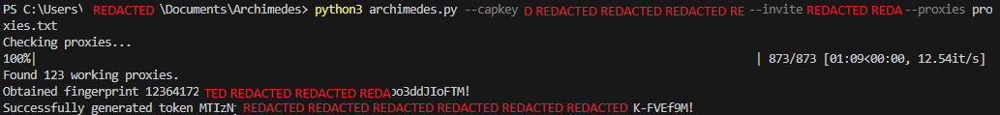

# Archimedes
## About
Archimedes is a small python script that facilitates the mass-creation of Discord accounts. All it needs is a list of HTTP proxies stored in a file (specified to the script using the `--proxies` command-line flag), an invite link (specified using `--invite`), and a CapMonster key (specified using `--capkey`).
Although it's currently hardcoded here, you can still edit the script to support 2captcha by just changing one line.
I am planning on supporting mass phone verification for this too, since using free proxies causes the tokens to generate, but in a locked state.
## Support me
I'll soon put a Bitcoin or Monero address here, but while I don't have these listed for now, you can just support me by joining my [Discord](https://discord.gg/dreamybullxxx) server.
Supporting me allows me to continue the development of projects like these while keeping them free, open-source, and public for everyone.
## Screenshot

## License
Archimedes is licensed under GPLv3, and you must follow it's rules & guidelines when using my code.